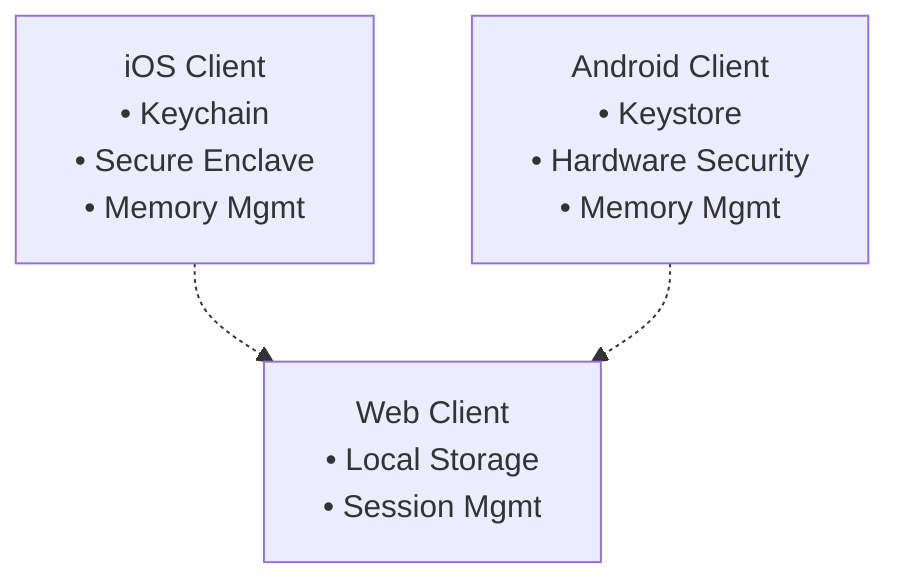
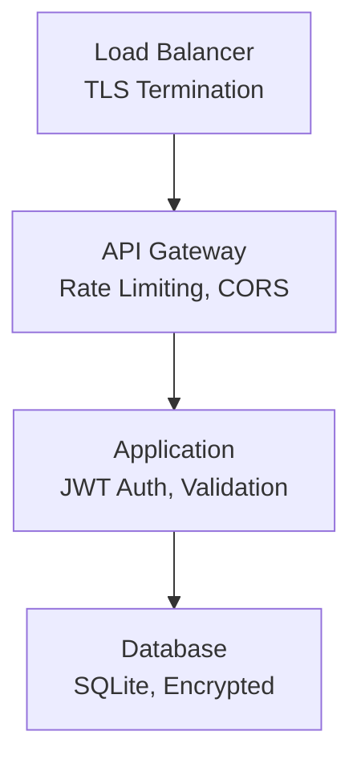

# Security Policy

> All these policies are not yet implemented. They are just guidelines for future reference.

## Overview

Whisp is a privacy-first ephemeral messaging application designed with security and privacy as core principles. This document outlines our security practices, vulnerability reporting process, and security considerations for users and developers.

## Security Principles

### Core Security Philosophy

- **Zero-knowledge architecture**: Server never stores message content or metadata
- **Ephemeral by design**: Messages exist only while both peers are online
- **End-to-end encryption**: All message content is encrypted client-side
- **Minimal data retention**: Only essential data for reachability is stored
- **Defense in depth**: Multiple layers of security controls

### Data Minimization

- **Server stores only**: Username, public keys, device tokens, and online presence
- **Never stored**: Message content, contact lists, safety numbers, IP addresses
- **Ephemeral storage**: Online presence and session data cleared on disconnect
- **No logs**: No message or connection logging on servers

## Supported Versions

| Version | Supported          |
| ------- | ------------------ |
| 1.0.x   | :white_check_mark: |
| < 1.0   | :x:                |

## Security Features

### Authentication & Authorization

- **JWT-based authentication** with 7-day expiration
- **Device-specific tokens** for multi-device support
- **Secure credential storage** using platform keychains
- **Username validation** with regex patterns (3-20 alphanumeric characters)

### Encryption & Key Management

- **Ed25519** for identity and device authentication
- **Curve25519** for ECDH key exchange
- **X3DH** key agreement protocol for forward secrecy
- **Double Ratchet** for continuous forward secrecy
- **Pre-key bundles** for asynchronous messaging

### Network Security

- **WebSocket over TLS** for real-time communication
- **CORS protection** with configurable origins
- **Rate limiting** to prevent abuse
- **Input validation** and sanitization
- **File size limits** (10MB maximum)

### Client Security

- **Secure storage** using iOS Keychain and Android Keystore
- **Certificate pinning** for API endpoints
- **Memory protection** with automatic clearing on app close
- **No persistent message storage** on device

## Vulnerability Reporting

### How to Report

We take security vulnerabilities seriously. If you discover a security vulnerability, please report it responsibly:

1. **Email**: <security@whisp.app>
2. **Subject**: "Security Vulnerability - [Brief Description]"
3. **Include**:
   - Description of the vulnerability
   - Steps to reproduce
   - Potential impact
   - Suggested fix (if any)

### What to Include

Please provide as much detail as possible:

- **Affected components** (client, server, protocol)
- **Attack vector** and prerequisites
- **Proof of concept** (if safe to share)
- **Severity assessment** (Critical/High/Medium/Low)
- **Your contact information** for follow-up

### Response Timeline

- **Acknowledgment**: Within 48 hours
- **Initial assessment**: Within 7 days
- **Fix timeline**: Depends on severity
  - Critical: 24-48 hours
  - High: 1-2 weeks
  - Medium: 2-4 weeks
  - Low: Next release cycle

### Responsible Disclosure

We follow responsible disclosure practices:

1. **Do not** publicly disclose vulnerabilities before we've had a chance to fix them
2. **Do not** use the vulnerability to access data you don't own
3. **Do not** disrupt our services
4. We will credit you (if desired) in our security advisories

## Security Considerations

### For Users

#### Best Practices

- **Keep apps updated** to the latest version
- **Use strong, unique usernames** that don't reveal personal information
- **Verify safety numbers** before trusting new contacts
- **Be cautious with file sharing** - only share files from trusted sources
- **Log out** when using shared devices

#### Privacy Settings

- **Discovery modes**: Choose appropriate privacy level for your needs
- **Friend verification**: Use Friend Verification Codes (FVC) for added security
- **Presence controls**: Manage who can see your online status

#### Threat Model

Whisp protects against:

- **Server compromise**: No message content is stored on servers
- **Network surveillance**: End-to-end encryption protects message content
- **Device theft**: Credentials are stored in secure hardware
- **Metadata collection**: Minimal metadata is stored and transmitted

### For Developers

#### Code Security

- **Input validation**: All user inputs are validated and sanitized
- **SQL injection prevention**: Using parameterized queries
- **XSS protection**: Proper output encoding
- **CSRF protection**: Token-based validation
- **Secure headers**: Security headers implemented

#### Dependencies

- **Regular updates**: Keep dependencies updated
- **Vulnerability scanning**: Regular security audits
- **Minimal dependencies**: Only essential packages included
- **License compliance**: All dependencies properly licensed

#### Development Practices

- **Code review**: All changes require review
- **Security testing**: Regular penetration testing
- **Secure defaults**: Security-first configuration
- **Documentation**: Security considerations documented

## Security Architecture

### Client-Side Security

### Server-Side Security

### Network Security

- **TLS 1.3** for all communications
- **Certificate pinning** on mobile clients
- **HSTS** headers for web clients
- **Perfect Forward Secrecy** with ephemeral keys
- **No insecure protocols** (HTTP, plain WebSocket)

## Security Monitoring

### Logging & Monitoring

- **Authentication events**: Login attempts, token validation
- **API usage**: Rate limiting, error rates
- **System health**: Server performance, memory usage
- **Security events**: Failed authentications, suspicious activity

### Incident Response

1. **Detection**: Automated monitoring and alerting
2. **Assessment**: Impact and severity evaluation
3. **Containment**: Immediate threat mitigation
4. **Eradication**: Root cause analysis and fix
5. **Recovery**: Service restoration and monitoring
6. **Lessons learned**: Process improvement

## Compliance & Standards

### Security Standards

- **OWASP Top 10**: Protection against common vulnerabilities
- **NIST Cybersecurity Framework**: Risk management approach
- **ISO 27001**: Information security management
- **SOC 2**: Security, availability, and confidentiality

### Privacy Regulations

- **GDPR**: European data protection compliance
- **CCPA**: California consumer privacy rights
- **PIPEDA**: Canadian privacy protection
- **Minimal data collection**: Privacy by design

## Security Updates

### Update Process

1. **Security patches**: Released as soon as possible
2. **Feature updates**: Regular release cycle
3. **Critical fixes**: Emergency releases when needed
4. **Deprecation notices**: Advance warning for breaking changes

### Communication

- **Security advisories**: Published for significant issues
- **Release notes**: Detailed changelog for each version
- **User notifications**: In-app notifications for critical updates
- **Developer alerts**: Email notifications for security issues

## Contact Information

### Security Team

- **Email**: <krushn@dayshmookh.com>
- **PGP Key**: [Available on request]
- **Response time**: 24-48 hours for security issues

### General Support

- **Email**: <support@whisp.app>
<!-- - **Documentation**: [GitHub Wiki](https://github.com/krushndayshmookh/whisp/wiki) -->
- **Issues**: [GitHub Issues](https://github.com/krushndayshmookh/whisp/issues)

## Acknowledgments

We thank the security researchers and community members who help keep Whisp secure through responsible disclosure and ongoing security improvements.

---

**Last Updated**: September 2025  
**Version**: 0.1.0  
**Next Review**: December 2025
